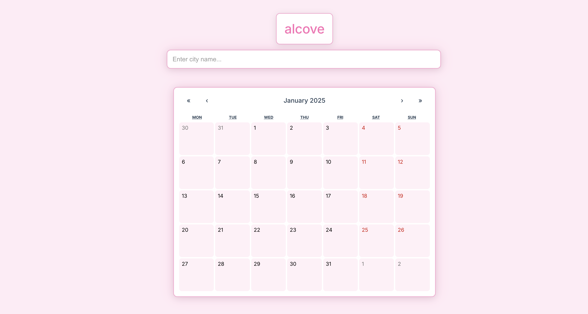

# Alcove: Your Smart Travel Companion 🌍✈️

## Description

Alcove is an intuitive travel planning application that helps you organize your journeys with ease. The app combines weather data, city information, and personal itinerary management to create a seamless travel planning experience. With its elegant and minimalistic design, Alcove provides a calming yet practical interface for all your travel planning needs.

Key features include:
- Interactive calendar with color-coded city assignments
- Real-time weather information for cities worldwide
- Detailed itinerary planning with time-based activities
- Smart city search with location validation
- Elegant user interface with a minimalistic design

## Getting Started

### Live Demo

https://travel-app-six-orcin.vercel.app/

### Planning Materials

- draw.io

## Technologies Used

### Frontend
- React.js with Vite
- React Router for navigation
- React Calendar for date management
- React DatePicker for date range selection
- CSS3 with custom styling

### Backend & APIs
- Airtable for data persistence
- OpenWeather API for city and weather data

### Development Tools
- Git & GitHub for version control
- Environment variables for secure API key management
- Responsive design principles

## Attributions

### APIs
- OpenWeather API: Weather data integration
- Google Places API: City information and validation
- REST Countries API: Country details and information

### Design Resources
- Inter font family from Google Fonts
- Custom CSS animations and transitions
- Inspiration from Apple's minimalistic design principles

## Next Steps

### Planned Enhancements
1. Multi-city route optimization
2. Travel budget tracking and management
3. Offline mode for itinerary access
4. Social sharing features for trip plans
5. Integration with hotel and flight booking APIs
6. Mobile app development
7. Integration with Google Maps for navigation
8. AI-powered trip recommendations