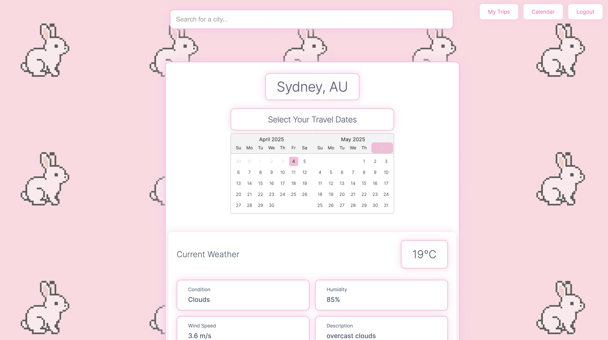

# Alcove: Your Smart Travel Companion 🌍✈️



## Overview

Alcove is an elegant, minimalist travel planning application designed to streamline your journey organization. With real-time weather data, city information, and personalized itinerary management, Alcove creates a seamless experience for global travelers.

### Key Features

- **Interactive Calendar**: Plan your trips with a color-coded calendar that visually maps your journey
- **Smart City Search**: Find destinations worldwide with location validation
- **Weather Information**: Access current weather data for your selected destinations
- **Attractions & Landmarks**: Discover the must-see locations in each city
- **Transportation Details**: Get information on airports, transit options, and travel accessibility
- **PDF Export**: Generate professional travel itineraries for offline access
- **Email Sharing**: Send your travel plans to your inbox with a single click
- **Trip Shifting**: Need to adjust dates? Easily move entire trips without losing your planned activities

## Live Demo

Experience Alcove at: [https://alcove-eight.vercel.app/](https://alcove-eight.vercel.app/)

## Technologies Used

### Frontend
- **React** with Hooks and Context API for state management
- **React Router** for seamless navigation
- **React Calendar** for date management
- **React DatePicker** for intuitive date selection
- **Google OAuth** for secure authentication
- **Custom CSS** with a minimalist design approach

### Backend
- **Node.js** with Express for the server framework
- **MongoDB Atlas** for database storage
- **Mongoose** for data modeling and management
- **JWT** for secure authentication
- **Nodemailer** for email functionality
- **html-pdf-node** for PDF generation

### APIs
- **Google Maps Platform** for city information, landmarks, and transportation details
- **OpenWeatherMap API** for real-time weather data
- **Google OAuth** for user authentication

### Development & Deployment
- **Vite** for frontend development and building
- **Vercel** for frontend deployment
- **Render** for backend deployment
- **Git & GitHub** for version control

## App Structure & Workflow

1. **Authentication**: Users sign in with Google for a seamless, secure experience
2. **Calendar View**: The main dashboard displays trips on an interactive calendar
3. **City Search**: Users can search for and explore potential destinations
4. **City Details**: Each city displays weather, landmarks, and transportation information
5. **Date Selection**: Users select travel dates for their chosen destination
6. **Itinerary Management**: Activities can be scheduled for each day with times and descriptions
7. **Trip Management**: Users can view, edit, shift, or delete entire trips
8. **Export Options**: Itineraries can be downloaded as PDFs or emailed for sharing and offline access

## Security Features

- JWT authentication with secure token management
- Google OAuth for reliable third-party authentication
- Environment variables for API key protection
- MongoDB Atlas network security configuration

## Accessibility & Design

- Elegant, minimalist UI inspired by Apple's design language
- Responsive layouts for different device sizes
- WCAG 2.0 AA compliant color contrast ratios
- Proper semantic HTML structure
- Intuitive navigation and user flows

## Future Enhancements

1. **Multi-City Route Optimization**: Calculate the most efficient travel paths
2. **Budget Tracking**: Monitor and manage travel expenses
3. **Offline Mode**: Access itineraries without internet connection
4. **Social Sharing**: Share trip plans with fellow travelers
5. **Hotel & Flight Integration**: Add booking capabilities
6. **Mobile App**: Develop native mobile applications
7. **Navigation Integration**: Connect with mapping services for directions
8. **AI Recommendations**: Suggest activities based on preferences and past trips

## Installation & Local Development

### Prerequisites
- Node.js (v14+)
- MongoDB instance
- API keys for Google Maps, OpenWeatherMap

### Setup Instructions

1. Clone the repository
   ```
   git clone https://github.com/yourusername/alcove-travel-app.git
   cd alcove-travel-app
   ```

2. Install backend dependencies
   ```
   cd backend
   npm install
   ```

3. Install frontend dependencies
   ```
   cd ../frontend
   npm install
   ```

4. Configure environment variables
   - Create `.env` files in both frontend and backend directories
   - Add necessary API keys and configuration values

5. Start development servers
   ```
   # In backend directory
   npm run dev
   
   # In frontend directory
   npm run dev
   ```

## Acknowledgments

- Weather data provided by OpenWeatherMap
- City information and mapping provided by Google Maps Platform
- Authentication services by Google OAuth

---

Developed by Sean Young